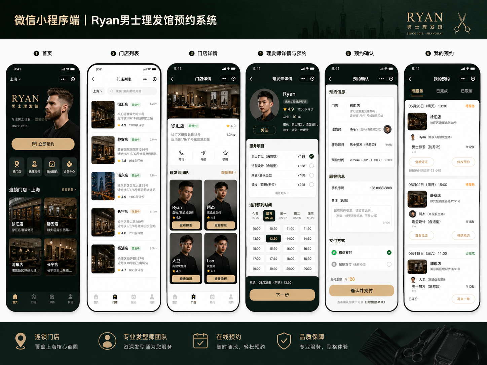
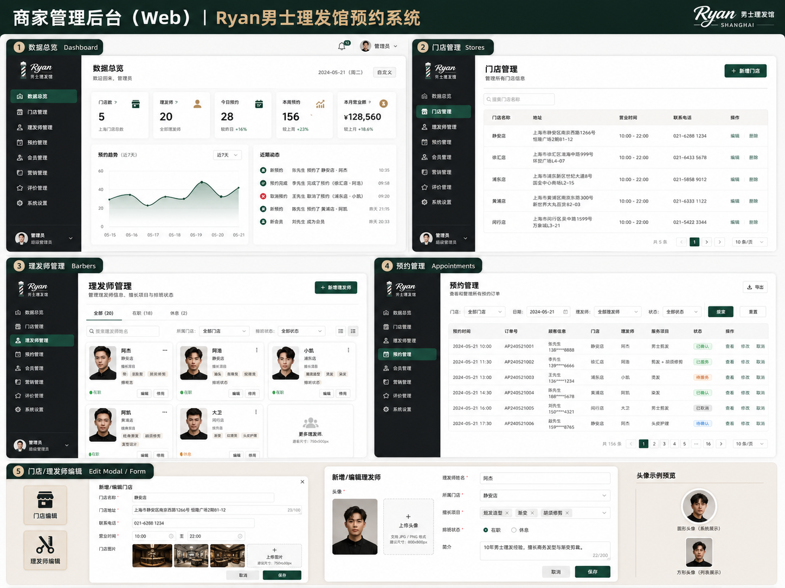

# Ryan 男士理发馆 · 预约系统

> Men's Barber Shop WeChat Mini Program — 一套完整的男士理发馆线上预约系统，包含**微信小程序**（顾客端）、**Vue 管理后台**（商家端）和 **Node.js 后端**（Express + Supabase）。

顾客可在小程序中浏览门店、选择理发师与服务、按时段预约下单并查看自己的预约记录；商家可在后台管理门店、理发师、服务项目、订单，并在数据看板查看经营概览。

---

## 📸 界面预览

| 微信小程序（顾客端） | 管理后台（商家端） |
| :---: | :---: |
|  |  |

---

## ✨ 功能特性

### 顾客端（微信小程序）
- 首页 banner 与门店推荐
- 门店列表（支持按城市筛选）与门店详情
- 选择理发师 → 选择服务项目 → 选择可用时段
- 下单确认，生成订单号
- 「我的」页查看历史预约、个人头像

### 商家端（管理后台）
- 管理员登录鉴权
- 数据看板：门店数 / 理发师数 / 今日 & 本周预约量 / 当月营收 / 预约趋势图（ECharts）
- 门店管理（增删改）
- 理发师管理（增删改）
- 服务项目管理
- 预约订单管理（含下单时间，按北京时间统计）
- 图片上传（门店图、理发师头像）

---

## 🧱 技术栈

| 模块 | 技术 |
| --- | --- |
| 顾客端 | 微信小程序原生（WXML / WXSS / JS） |
| 管理后台 | Vue 3 · Vite · Element Plus · Vue Router · ECharts · Axios |
| 后端 | Node.js · Express · Supabase（PostgreSQL + Storage） · Multer |
| 测试 | Jest · Supertest |

---

## 📁 目录结构

```
.
├── miniprogram/        # 微信小程序（顾客端）
│   ├── pages/          # index / stores / store-detail / barber / confirm / my
│   ├── images/         # 静态图片与 tabBar 图标
│   ├── utils/          # 工具方法
│   └── app.json        # 小程序全局配置（页面、tabBar）
├── admin/              # 管理后台（Vue 3 + Vite）
│   └── src/
│       ├── views/      # Dashboard / Stores / Barbers / Services / Appointments / Login
│       ├── layout/     # AdminLayout
│       ├── router/     # 路由
│       └── api/        # axios 封装
├── server/             # 后端（Express + Supabase）
│   ├── src/
│   │   ├── routes/     # auth / stores / barbers / services / appointments / dashboard / upload
│   │   ├── middleware/ # auth / error
│   │   └── utils/      # orderNo（订单号）/ timeslots（时段计算）
│   ├── sql/            # schema.sql 建表 + seed.js 演示数据
│   └── tests/          # Jest 接口测试
└── docs/               # 设计文档
```

---

## 🚀 快速开始

### 1. 后端（server）

```bash
cd server
npm install
```

准备 Supabase：

1. 在 [supabase.com](https://supabase.com) 创建项目
2. SQL Editor 执行 `sql/schema.sql`（如需服务项目表，再执行 `sql/migration-002-services.sql`）
3. Storage 创建两个 **public** bucket：`avatars`、`store-images`
4. 复制 `.env.example` 为 `.env`，填入 Supabase 的三个值：

   ```env
   PORT=3000
   SUPABASE_URL=your-project-url
   SUPABASE_ANON_KEY=your-anon-key
   SUPABASE_SERVICE_ROLE_KEY=your-service-role-key
   ADMIN_USERNAME=admin
   ADMIN_PASSWORD=admin123
   ADMIN_TOKEN=your-admin-token
   ```

5. 灌入演示数据并启动：

   ```bash
   npm run seed     # 写入演示门店/理发师/服务
   npm start        # 启动服务，默认 http://localhost:3000
   npm test         # 运行接口测试
   ```

> 默认管理员：`admin` / `admin123`

### 2. 管理后台（admin）

```bash
cd admin
npm install
npm run dev        # 开发模式
npm run build      # 构建生产包
```

后台通过 `.env` 中的 `VITE_API_BASE` 指向后端 API（默认 `http://localhost:3000/api`）。

### 3. 微信小程序（miniprogram）

1. 用[微信开发者工具](https://developers.weixin.qq.com/miniprogram/dev/devtools/download.html)导入 `miniprogram/` 目录
2. `project.config.json` 中已配置 AppID，可按需替换为你自己的
3. 后端地址在小程序内配置为 `http://127.0.0.1:3000`（开发者工具中建议用 `127.0.0.1` 而非 `localhost`）

---

## 🔌 API 概览

基址：`/api`

| 模块 | 方法 & 路径 | 说明 |
| --- | --- | --- |
| 鉴权 | `POST /auth/login` · `POST /auth/admin-login` | 用户 / 管理员登录 |
| 门店 | `GET /stores` · `GET /stores/:id` · `POST /stores` · `PUT /stores/:id` · `DELETE /stores/:id` | 门店增删改查 |
| 理发师 | `GET /barbers` · `GET /barbers/:id` · `POST /barbers` · `PUT /barbers/:id` · `DELETE /barbers/:id` | 理发师增删改查 |
| 服务 | `GET /services` · `POST /services` · `PUT /services/:id` | 服务项目管理 |
| 预约 | `POST /appointments` · `GET /appointments` · `PUT /appointments/:id` · `GET /appointments/admin` · `PUT /appointments/admin/:id` | 顾客下单 / 后台管理订单 |
| 看板 | `GET /admin/dashboard` | 经营数据概览 |
| 上传 | `POST /upload` | 图片上传至 Supabase Storage |

---

## 🗄️ 数据模型

核心数据表（PostgreSQL / Supabase）：

- `stores` — 门店
- `barbers` — 理发师
- `services` — 服务项目
- `appointments` — 预约订单
- `admins` — 管理员账号

---

## 📄 License

本项目基于 [MIT License](./LICENSE) 开源。
